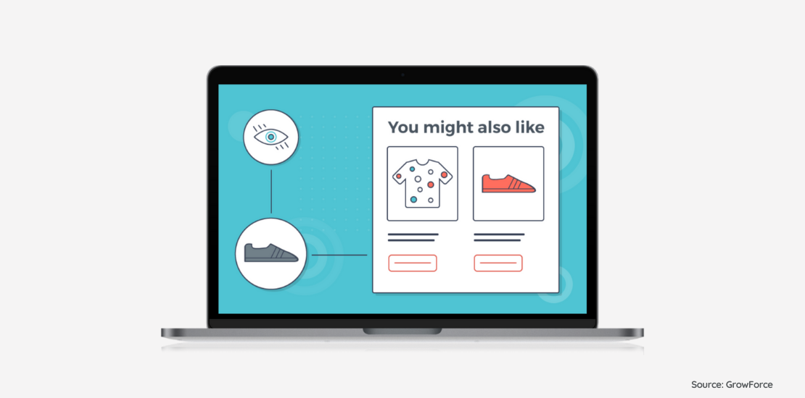

# AI-Powered E-commerce Chatbot with Vector Search and LLM Integration



## Overview

This repo implements a full-stack AI-powered e-commerce recommendation system that combines Retrieval Augmented Generation (RAG), Large Language Models (LLMs), and sentiment analysis to create an intelligent shopping assistant. The system enhances the customer shopping experience by leveraging machine learning techniques to help users discover relevant products along with personalized content and recommendations.

The chatbot provides:
- Semantic product search based on natural language queries
- Extraction of key product features
- Sentiment analysis of product reviews
- Contextual recommendations

## System Architecture

The project is built on Google Cloud Platform (GCP) with a microservices architecture:

```
llm-rag-based-ecommerce-recommender/
├── backend/            # FastAPI service for search and recommendations
├── bigQuery/           # SQL scripts for BigQuery table creation
├── final_report_files/ # Supporting files for the project report
├── frontend/           # React/Next.js web application
├── infra/              # Terraform files for GCP infrastructure
├── node_modules/       # Node.js dependencies
├── .gitignore          # Git ignore file
├── README.md           # Project documentation
├── etl_full.py         # ETL script for data processing
├── final_report.html   # Rendered HTML report
├── final_report.qmd    # Quarto markdown report
├── package-lock.json   # Node.js package lock
├── package.json        # Node.js package configuration
└── references.bib      # Bibliography for the report
```

### Data Pipeline

- Uses Amazon Reviews 2023 dataset from UCSD McAuley Lab
- Processes data with PySpark for ETL
- Stores data in Google Cloud Storage and BigQuery
- Generates vector embeddings using Vertex AI

### Backend

- Built with FastAPI for high-performance API endpoints
- Implements vector search using BigQuery and ScaNN
- Uses Retrieval Augmented Generation (RAG) with LangChain
- Integrates with Vertex AI's Gemini-2.0-Flash LLM

### Frontend

- Developed with React and Next.js
- Features a chat interface for natural language queries
- Displays product recommendations with extracted features
- Uses dynamic image scraping for product visuals

## Installation and Setup

### Prerequisites

- Python 3.9+
- Node.js 16+
- Google Cloud Platform account with:
  - BigQuery enabled
  - Vertex AI enabled
  - Cloud Storage configured

### Backend Setup

1. Navigate to the backend directory:
   ```bash
   cd backend
   ```

2. Install dependencies:
   ```bash
   pip install -r requirements.txt
   ```

3. Configure environment variables:
   ```bash
   export PROJECT_ID="your-gcp-project-id"
   export VERTEX_AI_REGION="us-central1"
   export BIGQUERY_DATASET_ID="your-bigquery-dataset"
   ```

4. Run the FastAPI server:
   ```bash
   uvicorn app.main:app --reload
   ```

### Frontend Setup

1. Navigate to the frontend directory:
   ```bash
   cd frontend
   ```

2. Install dependencies:
   ```bash
   npm install
   ```

3. Create a `.env.local` file with your API URL:
   ```
   NEXT_PUBLIC_API_URL=http://localhost:8000
   ```

4. Run the development server:
   ```bash
   npm run dev
   ```

### Data Pipeline Setup

1. Install ETL dependencies:
   ```bash
   pip install pyspark pandas datasets google-cloud-storage google-cloud-bigquery
   ```

2. Authenticate with GCP:
   ```bash
   gcloud auth application-default login
   ```

3. Run the ETL script:
   ```bash
   python etl_full.py
   ```

## Infrastructure Deployment

The project includes Terraform files for deploying the infrastructure to GCP:

1. Navigate to the infra directory:
   ```bash
   cd infra
   ```

2. Initialize Terraform:
   ```bash
   terraform init
   ```

3. Plan the deployment:
   ```bash
   terraform plan
   ```

4. Apply the configuration:
   ```bash
   terraform apply
   ```

## Tech Stack & System Design

### Tech Stack

**Backend**
- **FastAPI**: High-performance Python framework for building APIs
- **LangChain**: Framework for developing applications with LLMs
- **Vertex AI**: Google Cloud's machine learning platform used for embeddings and LLM access
- **BigQuery**: Serverless data warehouse used for storing and querying product and review data
- **ScaNN**: Scalable Nearest Neighbors for vector similarity search
- **PySpark**: Used for ETL data processing
- **Google Cloud Storage**: For storing processed datasets

**Frontend**
- **React**: JavaScript library for building user interfaces
- **Next.js**: React framework for production-grade applications
- **Tailwind CSS**: Utility-first CSS framework for styling
- **Axios**: Promise-based HTTP client for API requests

**Infrastructure**
- **Terraform**: Infrastructure as Code tool for provisioning GCP resources
- **Google Cloud Platform**: Cloud services provider
  - Cloud Run: For deploying containerized applications
  - BigQuery: For vector search and data storage
  - Vertex AI: For ML model hosting and inference

### System Design

The system follows a microservices architecture with these key components:

1. **Data Processing Pipeline**:
   - Extracts data from the Amazon Reviews dataset
   - Processes and cleans data with PySpark
   - Generates embeddings using Vertex AI
   - Loads data into BigQuery with vector indexes

2. **API Layer**:
   - RESTful API built with FastAPI
   - Authentication and rate limiting middleware
   - Optimized for low-latency responses

3. **Search & Recommendation Engine**:
   - Hybrid search combining vector similarity and metadata filtering
   - RAG (Retrieval Augmented Generation) pipeline that:
     - Converts user queries to vector embeddings
     - Retrieves relevant products and reviews from BigQuery
     - Creates context-specific prompts for the LLM
     - Generates structured recommendations

4. **Web Interface**:
   - Responsive chat interface for natural language queries
   - Product card display with dynamic loading
   - Real-time recommendation display with extracted features
   - Image scraping functionality for product visuals

5. **Integration Layer**:
   - Connects frontend to backend services
   - Handles error states and loading indicators
   - Manages API response formatting

This architecture ensures scalability, maintainability, and performance, allowing for independent scaling of components based on load.

## Evaluation Metrics

The system's performance is evaluated using:

- Mean Reciprocal Rank (MRR)
- Normalized Discounted Cumulative Gain (nDCG@k)
- Feature Extraction Precision and Recall
- Sentiment Classification Accuracy
- Response Latency

## Contributing

Contributions are welcome! Please feel free to submit a Pull Request.

## License

This project is licensed under the MIT License - see the LICENSE file for details.

## Acknowledgments

- UCSD McAuley Lab for the Amazon Reviews 2023 dataset
- Google Cloud Platform for infrastructure support
- LangChain community for RAG implementation resources
