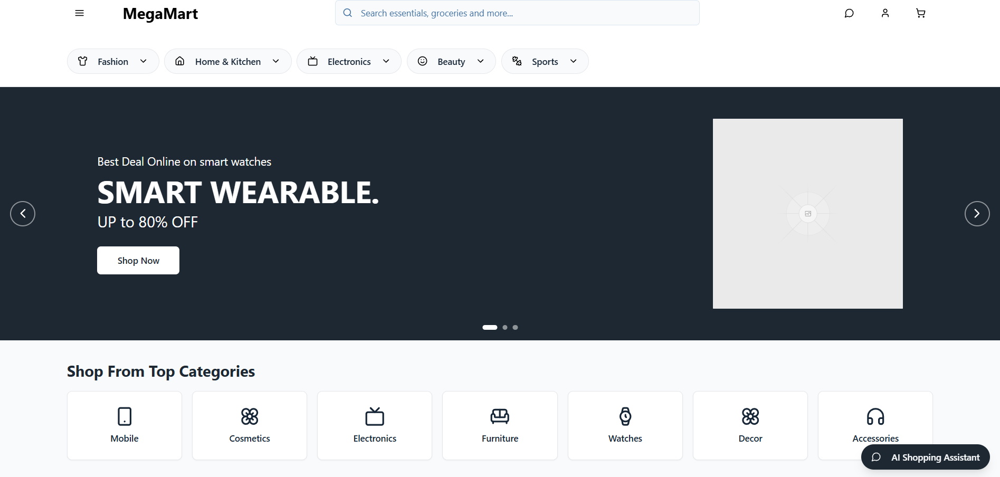

# RAG‑based Semantic Retrieval Recommender for E-commerce


## Overview

This repository implements a Retrieval-Augmented Generation (RAG) driven semantic recommender and information retrieval (IR) system built on Google Cloud infrastructure. Its purpose is to enhance the customer shopping experience by leveraging machine learning techniques to help users discover relevant products along with personalized content and recommendations. 

The system combines:
- Semantic product search based on natural language queries
- Extraction of key product features
- Sentiment analysis of product reviews
- Contextual recommendations

The primary goal is reproducible, high-throughput semantic retrieval for product recommendation and explainable, context-rich natural language responses.




## Key Technical Highlights

- **Hybrid retrieval**: ANN vector search + metadata filters (category, brand, price ranges) for high-precision recall.
- **Vector store**: BigQuery vector columns and ScaNN for approximate nearest neighbor search; embeddings produced by configurable embedding model.
- **RAG pipeline**: Multi-stage retrieval (candidate retrieval → re-ranking → context assembly → LLM prompt + generation). Supports chunking, passage-scoring, and grounding.
- **Evaluation**: Offline IR metrics (MRR, nDCG@k) and online/latency measurements to balance retrieval depth vs. response time.

### Data Pipeline

- Uses Amazon Reviews 2023 dataset from UCSD McAuley Lab
- Processes data with PySpark for ETL
- Stores data in Google Cloud Storage and BigQuery
- Generates vector embeddings using Vertex AI

### Backend

- Built with FastAPI for high-performance API endpoints
- Implements vector search using BigQuery and ScaNN
- Uses Retrieval Augmented Generation (RAG) with LangChain
- Integrates with Vertex AI's Gemini-2.5-pro LLM

### Frontend

- Developed with React and Next.js
- Features a chat interface for natural language queries
- Displays product recommendations with extracted features
- Uses dynamic image scraping for product visuals

## File Structure

The project is built on Google Cloud Platform (GCP) with the following file structure:

```
llm-rag-based-ecommerce-recommender/
├── backend/            # FastAPI service for search and recommendations
├── bigQuery/           # SQL scripts for BigQuery table creation
├── final_report_files/ # Supporting files for the project report
├── frontend/           # React/Next.js web application
├── infra/              # Terraform files for GCP infrastructure
├── node_modules/       # Node.js dependencies
├── .gitignore          # Git ignore file
├── README.md           # Project documentation
├── etl_full.py         # ETL script for data processing
├── final_report.html   # Rendered HTML report
├── final_report.qmd    # Quarto markdown report
├── package-lock.json   # Node.js package lock
├── package.json        # Node.js package configuration
└── references.bib      # Bibliography for the report
```

## High-level Architecture 

1. Data Ingestion & ETL
   - Source: Amazon Reviews dataset (preprocessed by product and review).
   - Pipeline: cleaning, normalization, deduplication, chunking long reviews into passages.
   - Output: document records with metadata ([] `product_id`, `category`, `title`, `review_id`, `rating`, `timestamp`) and text passages.

2. Embedding Generation
   - Embedding model is configurable (Vertex AI embeddings by default). Typical embedding dim: 1,024 (configurable per model).
   - Batched embedding generation with retry/backoff and idempotent writes to BigQuery.

3. Vector Indexing & Storage
   - Vectors stored as `ARRAY<FLOAT64>` in BigQuery tables with auxiliary metadata columns.
   - ANN runtime: ScaNN used for approximate nearest neighbor retrieval where available; BigQuery vector search serves as the primary store for scale and analytical joins.

4. Retrieval Pipeline
   - Stage 1 (Candidate Retrieval): Query → embedding → ANN k-nearest neighbors (k configurable, default 50) with optional metadata filters.
   - Stage 2 (Re-ranking): Lightweight BM25-like scoring or cross-encoder scoring applied to top N candidates for precision (N ≪ k).
   - Stage 3 (Context Assembly): Select top passages/products, deduplicate, and assemble prompt context with provenance (source ids & snippets).
   - Stage 4 (Generation): Prompt the LLM (e.g., Gemini / other LLM) with structured context and instructions to generate recommendations and explanations.

5. Serving & API
   - FastAPI endpoints: `/search/semantic`, `/rag/query`, `/ingest`, `/metrics`.
   - Response schema includes candidate ids, scores, provenance snippets, aggregated signals (avg rating, sentiment), and a `generated_answer` field when RAG is used.

## Installation and Setup

### Prerequisites

- Python 3.9+
- Node.js 16+
- Google Cloud Platform account with:
  - Cloud Run enabled
  - BigQuery enabled
  - Vertex AI enabled
  - Cloud Storage configured


### Backend Setup

1. Navigate to the backend directory:
   ```bash
   cd backend
   ```

2. Install dependencies:
   ```bash
   pip install -r requirements.txt
   ```

3. Configure environment variables:
   ```bash
   export PROJECT_ID="your-gcp-project-id"
   export VERTEX_AI_REGION="us-central1"
   export BIGQUERY_DATASET_ID="your-bigquery-dataset"
   ```

4. Run the FastAPI server:
   ```bash
   uvicorn app.main:app --reload
   ```

### Frontend Setup

1. Navigate to the frontend directory:
   ```bash
   cd frontend
   ```

2. Install dependencies:
   ```bash
   npm install
   ```

3. Create a `.env.local` file with your API URL:
   ```
   NEXT_PUBLIC_API_URL=http://localhost:8000
   ```

4. Run the development server:
   ```bash
   npm run dev
   ```

### Data Pipeline Setup

1. Install ETL dependencies:
   ```bash
   pip install pyspark pandas datasets google-cloud-storage google-cloud-bigquery
   ```

2. Authenticate with GCP:
   ```bash
   gcloud auth application-default login
   ```

3. Run the ETL script:
   ```bash
   python etl_full.py
   ```

## Infrastructure Deployment

The project includes Terraform files for deploying the infrastructure to GCP:

1. Navigate to the infra directory:
   ```bash
   cd infra
   ```

2. Initialize Terraform:
   ```bash
   terraform init
   ```

3. Plan the deployment:
   ```bash
   terraform plan
   ```

4. Apply the configuration:
   ```bash
   terraform apply
   ```

## Tech Stack & System Design

### Tech Stack

**Backend**
- **FastAPI**: High-performance Python framework for building APIs
- **LangChain**: Framework for developing applications with LLMs
- **Vertex AI**: Google Cloud's machine learning platform used for embeddings and LLM access
- **BigQuery**: Serverless data warehouse used for storing and querying product and review data
- **ScaNN**: Scalable Nearest Neighbors for vector similarity search
- **PySpark**: Used for ETL data processing
- **Google Cloud Storage**: For storing processed datasets

**Frontend**
- **React**: JavaScript library for building user interfaces
- **Next.js**: React framework for production-grade applications
- **Tailwind CSS**: Utility-first CSS framework for styling
- **Axios**: Promise-based HTTP client for API requests

**Infrastructure**
- **Terraform**: Infrastructure as Code tool for provisioning GCP resources
- **Google Cloud Platform**: Cloud services provider
  - Cloud Run: For deploying containerized applications
  - BigQuery: For vector search and data storage
  - Vertex AI: For ML model hosting and inference

### System Design

The system follows a microservices architecture with these key components:

1. **Data Processing Pipeline**:
   - Extracts data from the Amazon Reviews dataset
   - Processes and cleans data with PySpark
   - Generates embeddings using Vertex AI
   - Loads data into BigQuery with vector indexes

2. **API Layer**:
   - RESTful API built with FastAPI
   - Authentication and rate limiting middleware
   - Optimized for low-latency responses

3. **Search & Recommendation Engine**:
   - Hybrid search combining vector similarity and metadata filtering
   - RAG (Retrieval Augmented Generation) pipeline that:
     - Converts user queries to vector embeddings
     - Retrieves relevant products and reviews from BigQuery
     - Creates context-specific prompts for the LLM
     - Generates structured recommendations

4. **Web Interface**:
   - Responsive chat interface for natural language queries
   - Product card display with dynamic loading
   - Real-time recommendation display with extracted features
   - Image scraping functionality for product visuals

5. **Integration Layer**:
   - Connects frontend to backend services
   - Handles error states and loading indicators
   - Manages API response formatting

## Retrieval & Ranking Details

- **Hybrid scoring**: final score = alpha * vector_score + beta * metadata_boost + gamma * recency_boost (weights tunable).
- **Chunking**: Long reviews are chunked (stride overlap) to keep embedding contexts < model max tokens while preserving continuity.
- **Deduplication**: Candidate deduplication by product id and by highly-similar passage similarity threshold.
- **Reranking**: Optionally use a cross-encoder on top candidates for stronger relevance signals before generating.

## Prompting & Grounding (RAG)

- Prompts are programmatically assembled: instruction header, user query, ordered contextual snippets (with source markers), and generation constraints (format, length).
- Grounding strategy: restrict the LLM to use only provided snippets for factual claims and include provenance links in responses.
- Safety & hallucination mitigation: truncate/omit low-confidence sources; include fallback heuristics when context coverage is insufficient.

## Configuration & Tuning

- `k` (ANN candidates): larger `k` increases recall but costs latency and compute.
- Re-ranker `N`: tuning tradeoff between precision and LLM prompt token cost.
- Weights (alpha/beta/gamma): tuned on offline validation (MRR, nDCG) and online A/B tests.

## Evaluation

- Offline evaluation uses held-out queries and metrics:
  - **MRR**: measures how high the first relevant item appears.
  - **nDCG@k**: evaluates ranking quality with graded relevance.
  - **Precision/Recall**: for extracted features and sentiment labels.
- Latency and cost profiling: measure per-request latency (embedding + retrieval + re-ranking + LLM generation) and per-1000-queries cost estimate.

## Contributing

Contributions are welcome! Please feel free to fork the repo and submit a pull request.

## License

This project is licensed under the MIT License - see the LICENSE file for details.

## Acknowledgments & References

- Retrieval-Augmented Generation (RAG) literature and LangChain examples.
- BigQuery vector search and ScaNN documentation.
- UCSD McAuley Lab for the Amazon Reviews 2023 dataset
- Google Cloud Platform for infrastructure support
- LangChain community for RAG implementation resources
